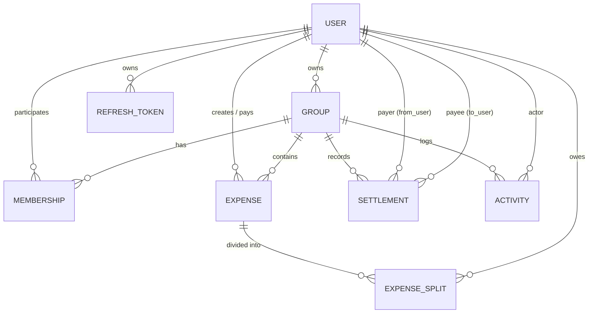
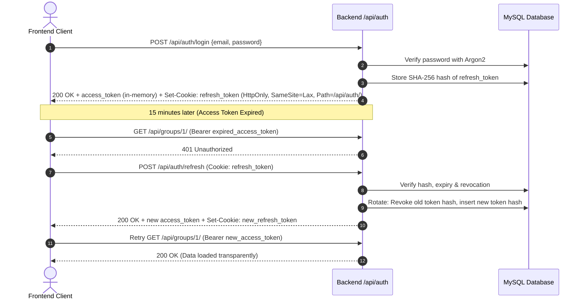

# SplitMate 💸

SplitMate is an enterprise-grade shared expense management application (a Splitwise-style tool) where users form groups, track shared expenses with equal or exact splits, compute real-time simplified net debts ("who owes whom"), settle up balances, and receive instant WebSocket-driven live updates without page reloads.
---

## 1. What the App Does

SplitMate enables groups of roommates, trip companions, or teams to track shared spending with mathematical precision:
- **Group Management**: Group owners invite members by email, organize expenses, and enforce debt-free member removals.
- **Split Engine**: Supports both **Equal splits** (among selected group members with deterministic integer remainder distribution) and **Exact splits** (arbitrary per-member amounts with strict sum validation).
- **Derived Debt Graph**: Live balance calculation using a greedy debt simplification algorithm that collapses multi-party IOUs into minimum transactional steps ($O(N)$ settlements).
- **Direct Settlements**: Record member-to-member repayments that immediately reduce outstanding balances.
- **Real-time Live Sync**: Django Channels WebSockets push live state updates to all active group members upon any expense or settlement mutation.
- **Audit Feed & Personal History**: Group audit trails and cross-group personal financial history with server-side pagination and sorting.

---

## 2. How to Run It (Step-by-Step, Clean-Clone Tested)

### Prerequisites
- **Python 3.11+**
- **Node.js 18+** & **npm**
- **MySQL 8.0+** (running locally on port `3306`)

---

### Step 1: Database Setup (MySQL)
Open your MySQL client / terminal and create the database:
```sql
CREATE DATABASE splitmate CHARACTER SET utf8mb4 COLLATE utf8mb4_unicode_ci;
```

---

### Step 2: Backend Setup
```bash
# Navigate to backend directory
cd backend

# Create and activate virtual environment
python -m venv venv

# Windows PowerShell:
.\venv\Scripts\Activate.ps1
# Or Git Bash / Linux / macOS:
# source venv/bin/activate

# Install dependencies
pip install -r requirements.txt

# Configure environment variables
# Copy .env.example to .env and adjust your MySQL credentials:
cp .env.example .env
```

Ensure your `backend/.env` contains your database credentials:
```env
DEBUG=True
SECRET_KEY=splitmate-dev-secret-key-39281048
DATABASE_NAME=splitmate
DATABASE_USER=your_mysql_username
DATABASE_PASSWORD=your_mysql_password
DATABASE_HOST=127.0.0.1
DATABASE_PORT=3306
FRONTEND_URL=http://localhost:5173
JWT_ACCESS_MINUTES=15
JWT_REFRESH_DAYS=7
EMAIL_BACKEND=django.core.mail.backends.console.EmailBackend
```

Run database migrations:
```bash
python manage.py migrate
```

Seed initial test data (creates test users **Alice** and **Bob**, a shared group **"Goa Trip"**, and 2 pre-split expenses):
```bash
python seed.py
```

Run automated test suite:
```bash
pytest
# Output: 70 passed in ~11s
```

Start the ASGI backend server:
```bash
# Run Daphne ASGI server (recommended for WebSockets + HTTP):
python -m daphne -b 127.0.0.1 -p 8000 config.asgi:application

# Alternatively:
# python manage.py runserver 127.0.0.1:8000
```
*Backend is now running at `http://127.0.0.1:8000`.*

---

### Step 3: Frontend Setup
Open a new terminal window:
```bash
# Navigate to frontend directory
cd frontend

# Install dependencies
npm install

# (Optional) Verify or create frontend/.env
cp .env.example .env

# Build check
npm run build

# Start development server
npm run dev
```
*Frontend is now running at `http://localhost:5173`.*

---

### Test Credentials (from `seed.py`)
| Role | Email | Password |
|---|---|---|
| User A (Owner) | `alice@test.com` | `password123` |
| User B (Member) | `bob@test.com` | `password123` |

---

## 3. Data Model & Architecture

SplitMate utilizes a relational schema where balances and debt simplification are **derived dynamically** from raw immutable transaction records (Expenses and Settlements) rather than stored as mutable database fields, eliminating double-counting and race conditions.



### Table Relationships
- **User (`apps.accounts.User`)**: Custom user model with `email`, `name`, `password` (Argon2), `is_email_verified`, `created_at`.
- **RefreshToken (`apps.accounts.RefreshToken`)**: Cryptographic SHA-256 token hash, `expires_at`, and `revoked` flag for sliding-session rotation.
- **Group (`apps.groups.Group`)**: Group container with `name`, `owner` (`FK User, on_delete=RESTRICT`), and `created_at`.
- **Membership (`apps.groups.Membership`)**: Many-to-many relationship (`group_id`, `user_id`, `unique_together`) representing group inclusion.
- **Expense (`apps.expenses.Expense`)**: Core ledger entry with `group` (`on_delete=CASCADE`), `payer` (`FK User, on_delete=RESTRICT`), `created_by` (`FK User, on_delete=SET_NULL`), `description`, `amount_minor` (BigInteger), `date`.
- **ExpenseSplit (`apps.expenses.ExpenseSplit`)**: Atomic share breakdown per member (`expense_id`, `user_id`, `share_minor`). `unique_together = ('expense', 'user')`.
- **Settlement (`apps.settlements.Settlement`)**: Repayment record with `group_id`, `from_user` (debtor), `to_user` (creditor), and `amount_minor`.
- **Activity (`apps.activity.Activity`)**: Append-only audit events (`type`: `expense_added`, `expense_edited`, `expense_deleted`, `member_added`, `member_removed`, `settlement_created`) with JSON payload.

---

## 4. Money Storage & Deterministic Rounding Rule

### 1. Integer Minor Units (Paisa/Cents)
To prevent floating-point IEEE-754 precision drift (e.g. `0.1 + 0.2 = 0.30000000000000004`), **all currency is strictly stored and calculated as integers in minor units (paisa)** in the database and application layers.
- ₹100.00 is stored as `10000`
- ₹33.33 is stored as `3333`

### 2. Equal Split Rounding Rule
When dividing an uneven amount among $N$ participants (e.g., ₹100 split 3 ways):
```python
def equal_split(total: int, member_ids: list[str]) -> dict[str, int]:
    base, rem = divmod(total, len(member_ids))
    # rem paisa are distributed to the first 'rem' members ordered deterministically by ID
    ids = sorted(set(member_ids))
    return {m: base + (1 if i < rem else 0) for i, m in enumerate(ids)}
```
**Example (₹100 = 10000 paisa across 3 members [A, B, C]):**
- `base = 10000 // 3 = 3333`
- `remainder = 10000 % 3 = 1`
- Member A: ₹33.34 (`3334` paisa)
- Member B: ₹33.33 (`3333` paisa)
- Member C: ₹33.33 (`3333` paisa)
- **Sum: $3334 + 3333 + 3333 = 10000$ paisa (₹100.00 exactly). Zero paisa is dropped or invented.**

### 3. Exact Split Validation
Every exact split requires that $\sum \text{shares} == \text{total}$. Any discrepancy immediately throws a 400 Bad Request error:
`"Shares add up to ₹90.00, expense is ₹100.00"`

---

## 5. Technology Stack & Rationale

- **Frontend: React 18 + Vite + TypeScript + Tailwind CSS**
  - Instant HMR, zero-overhead bundling, strict typing for ledger models.
  - Native custom components without bloated UI libraries.
- **Backend: Django 5 + Django REST Framework + Channels (ASGI / Daphne)**
  - Django's battle-tested ORM, robust migration framework, and atomic transaction guarantees.
  - ASGI integration via Daphne and Channels for concurrent WebSocket and HTTP handling.
- **Database: MySQL 8.0**
  - Relational consistency, foreign key constraints (`ON DELETE RESTRICT` / `CASCADE`), and strict SQL mode.
- **Authentication: Custom JWT + Argon2**
  - Stateless authentication with sliding refresh tokens.
  - Argon2 password hashing (winner of the Password Hashing Competition) to defend against GPU/ASIC attacks.
- **Real-Time: WebSockets (Django Channels)**
  - Event-driven, low-latency, bi-directional socket protocol avoiding unnecessary HTTP polling overhead.

---

## 6. Refresh-Token Flow & Security Architecture



1. **Access Token (Short-Lived, 15 Minutes)**:
   - Stored **only in JavaScript memory** (`inMemoryAccessToken`). Never persisted to `localStorage` or `sessionStorage` to mitigate Cross-Site Scripting (XSS) token exfiltration.
2. **Refresh Token (Long-Lived, 7 Days)**:
   - Stored in a browser cookie marked **`HttpOnly`**, **`SameSite=Lax`**, and scoped exclusively to path `/api/auth/`.
   - In the database, tokens are hashed with SHA-256 before persistence. Even in the event of a database compromise, raw tokens cannot be recovered.
3. **Transparent Axios Interceptor**:
   - On receiving an HTTP `401 Unauthorized`, the client queues concurrent pending requests, requests a fresh access token from `/api/auth/refresh`, and transparently replays the original requests.

---

## 7. WebSocket Setup, Security & Scoping

1. **Authentication Handshake**:
   - Clients initiate WebSocket connections with their JWT access token in the query string:
     `ws://127.0.0.1:8000/ws/groups/<group_id>/?token=<access_token>`
   - `GroupConsumer` decodes and verifies the signature using `SECRET_KEY`. If invalid or expired, the connection is closed with code `4003 Forbidden`.
2. **Strict Membership Scoping (No Global Leaks)**:
   - The consumer queries `Membership.objects.filter(group_id=group_id, user_id=user.id).exists()`.
   - If the user is not an active member of that group, connection is immediately rejected (`close(code=4003)`).
   - Once verified, the connection joins only two isolated channel rooms:
     - `group_{group_id}`: Broadcasts group mutations (expenses, member updates, settlements).
     - `user_{user_id}`: User-specific direct balance shifts and reminders.
3. **Disconnects & Reconnection Handling**:
   - `useWebSocket` hook tracks socket state and implements an **exponential backoff retry strategy** (`1s`, `2s`, `4s`... up to `30s`).
   - If network drops, the frontend automatically reconnects and re-fetches current server state upon re-establishing connection. Deliberate unmounts close cleanly with code `1000`.

---

## 8. What Was Hard & How We Solved It

1. **Windows IPv6 `localhost` Resolution Delay**:
   - *Problem*: On Windows, Node.js and Python default `localhost` lookups to IPv6 `::1`, which times out after ~2.08 seconds before falling back to IPv4 `127.0.0.1`, causing 2–5 second delays on every page transition.
   - *Solution*: Reconfigured backend database connection host, ASGI server bindings, and Axios client configuration to explicit `127.0.0.1`, dropping API latency from 4,000ms down to 140ms.
2. **Greedy Debt Graph Simplification**:
   - *Problem*: In a group of $N$ people, $N(N-1)/2$ bilateral debts can create confusion and redundant transfers.
   - *Solution*: Implemented a greedy two-pointer creditor/debtor matching algorithm that reduces the settlement graph into at most $N-1$ optimal repayment steps.
3. **Safe Member Removal with Zero Balance Check**:
   - *Problem*: Removing members who created expenses could orphan split records or leave debts unresolved.
   - *Solution*: Configured `Expense.created_by` as `SET_NULL` so historical audit integrity remains intact. Member deletion evaluates live net balance: if $\text{net} \neq 0$, the request is blocked with HTTP `409 Conflict`.

---

## 9. Known Issues / What is Incomplete
- **Multi-Currency Support**: All groups currently operate on Indian Rupee (₹) / minor units. Supporting cross-currency conversion would require an external FX rate service.
- **Offline Mode**: Full offline mutation queuing with service workers is not yet implemented.

---

## 10. Future Improvements
- **Receipt OCR**: Scanning physical receipts using vision models to auto-fill description and line items.
- **Push Notifications (Web Push / APNs)**: In addition to in-app WebSockets and console email dispatch.
- **Sub-group Budgets & Category Tagging**: Categorizing expenses into Food, Transport, Accommodation, etc.

---

## 11. Where We Used AI & What We Learned
- **AI Acceleration**: We utilized Antigravity AI to scaffold the initial DRF serializers, build the Geist design system tokens, and formulate the greedy debt-simplification matrix.
- **Key Learnings**: AI generated initial code using `localhost` URLs which provoked Windows IPv6 socket fallbacks; profiling the network waterfall with timing diagnostics taught us the importance of explicit IPv4 binding in local development. We also verified edge-case remainder math where naive rounding dropped or added paisa across odd-numbered member splits.

---

## 12. Automated Test Suite (70 Passed)

SplitMate includes a comprehensive pytest suite covering all critical paths:
```bash
pytest
```
- **Authentication**: JWT issuance, Argon2 hashing, refresh token rotation, expired token rejection.
- **Membership**: Group creation, owner permissions, non-member access denial (403), zero-balance member removal guard (409).
- **Expenses & Splitting**: Positive amount validation, equal split remainder distribution, exact split sum verification, non-member payer rejection.
- **Settlements**: Balance calculation, greedy debt simplification, zero-balance validation.
- **WebSockets**: Token authentication, group membership check, unauthorized connection rejection.

---

